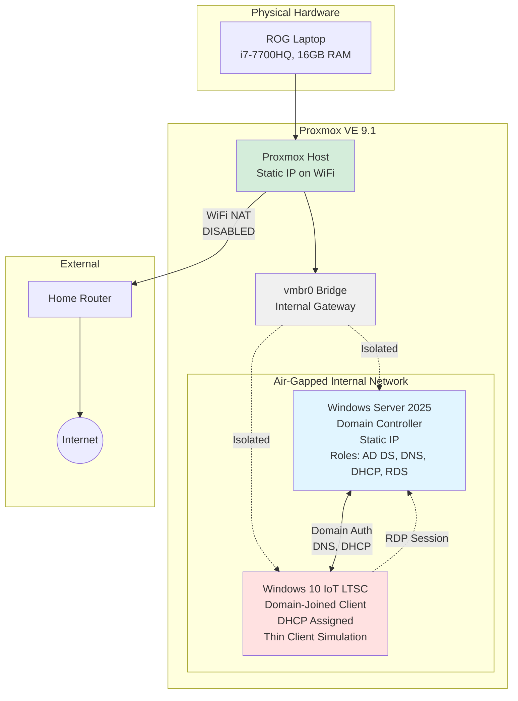

# Network Architecture Diagram

```mermaid
graph TB
    subgraph "Physical Hardware"
        Laptop[ROG Laptop<br/>i7-7700HQ, 16GB RAM]
    end
    
    subgraph "Proxmox VE 9.1"
        PVE[Proxmox Host<br/>Static IP on WiFi]
        Bridge[vmbr0 Bridge<br/>Internal Gateway]
        
        subgraph "Air-Gapped Internal Network"
            DC[Windows Server 2025<br/>Domain Controller<br/>Static IP<br/>Roles: AD DS, DNS, DHCP, RDS]
            Client[Windows 10 IoT LTSC<br/>Domain-Joined Client<br/>DHCP Assigned<br/>Thin Client Simulation]
        end
    end
    
    subgraph "External"
        Router[Home Router]
        Internet((Internet))
    end
    
    Laptop --> PVE
    PVE -->|WiFi NAT<br/>DISABLED| Router
    Router --> Internet
    PVE --> Bridge
    Bridge -.->|Isolated| DC
    Bridge -.->|Isolated| Client
    DC <-->|Domain Auth<br/>DNS, DHCP| Client
    Client -.->|RDP Session| DC
    
    style DC fill:#e1f5ff
    style Client fill:#ffe1e1
    style Bridge fill:#f0f0f0
    style PVE fill:#d4edda
```